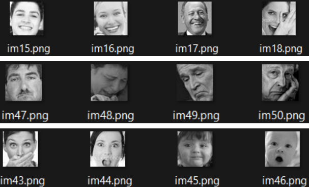
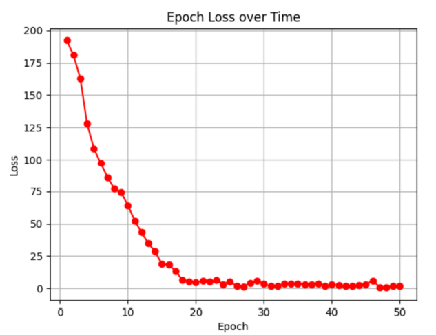
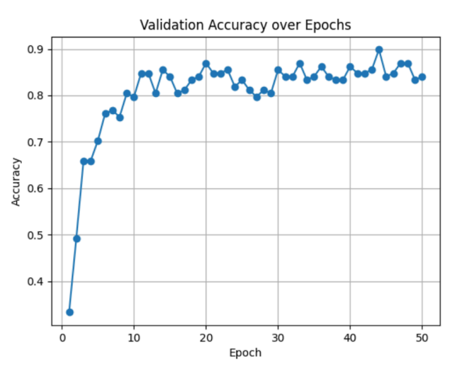
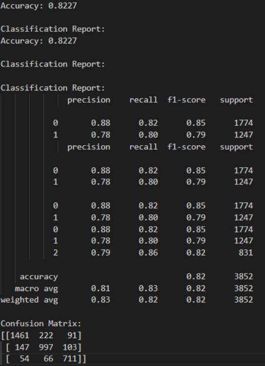
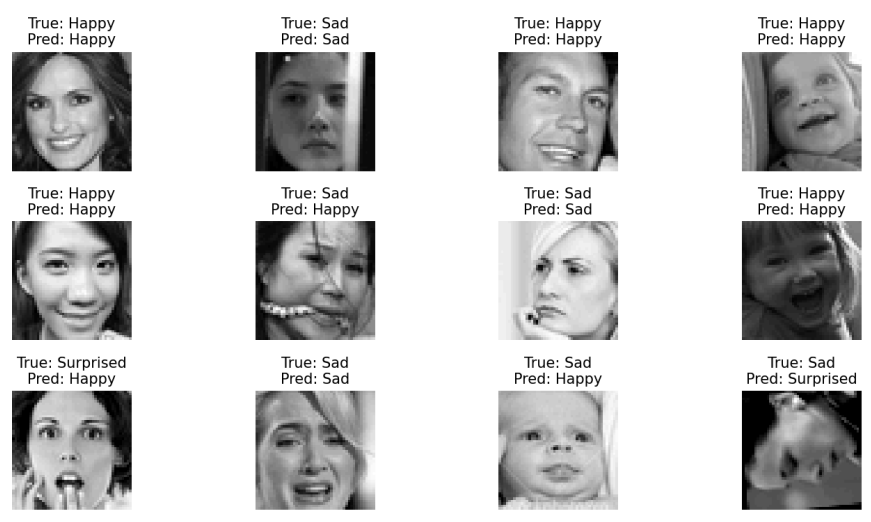
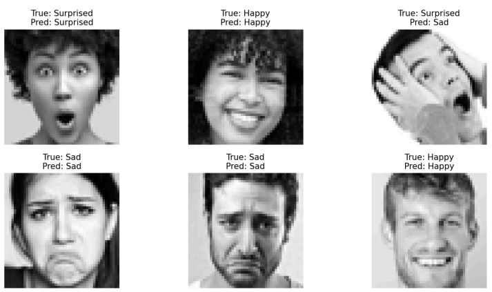

# Deep Learning Project

This project is a python implementation (using Pytorch) of a model used to recognize emotions in human faces

## Dataset Description

In this classification problem, we will use a dataset with images of faces, with 3 different emotions: happy, sad and surprised. The original dataset contains a folder for training and another one for testing. There are more images in the happy class, therefore data augmentation will be performed on the other two classes in order to have a balanced dataset. Augmentation will only be performed on the training set. Testing set will remain as it was (unequal number of images per class). Also, images will be extracted from the training set, to create the validation set. This is to be used throughout the training process to assess the model’s performance. The validation set size will be small, as we don’t need a big set of images to verify the model’s performance. The validation and test set images will not be used to train the model

The processed dataset contains:
  - Training: 7169 images per class (21507 images in total)
  - Validation: 46 images per class (138 images in total)
  - Testing: 1774 images for happy class, 1247 images for sad class, 831 images for surprised class.
The images are in grayscale format (only one channel). They have size 48*48 pixels

Example of images used:




## Model architecture

The model is a Convolutional Neural Network with six 2-dimensional convolutional layers. ReLU was used in order to scale values, and MaxPooling was used in order to reduce computational complexity, prevent overfitting, and extract important features at the same time. After the convolutional part, the output is flattened and passed to a Linear model (Fully connected NN) to gain knowledge about the hidden patterns contained in the output of the CNN. Initially, Sigmoid activation function was being used for the output of the model, but then it was corrected (as Sigmoid is better for binary classification problems). After correcting this, Cross Entropy Loss was used in the training process (which contains softmax function to scale big values). Pytorch has been used to implement the model.

Architecture:

```
        self.network = nn.Sequential(

            nn.Conv2d(1, 16, kernel_size=3, padding=1),
            nn.ReLU(),
            nn.Conv2d(16, 32, kernel_size=3, padding=1),
            nn.ReLU(),
            nn.MaxPool2d(kernel_size=2, stride=2),

            nn.Conv2d(32, 64, kernel_size=3, padding=1),
            nn.ReLU(),
            nn.Conv2d(64, 64, kernel_size=3, padding=1),
            nn.ReLU(),
            nn.MaxPool2d(2, 2),

            nn.Conv2d(64, 128, kernel_size=3, padding=1),
            nn.ReLU(),
            nn.Conv2d(128, 128, kernel_size=3, padding=1),
            nn.ReLU(),
            nn.MaxPool2d(2, 2),

            nn.Flatten(),
            nn.Linear(in_features=6*6*128, out_features=256),
            nn.ReLU(),
            nn.Linear(in_features=256, out_features=128),
            nn.ReLU(),
            nn.Linear(128, 3),
        )
```


## Results

Throughout the training process, the loss was recorded, as well as the accuracy on the
validation set, on every epoch. Here we can see the results of the training:

Epoch Loss throughout the training:



Validation set Accuracy throughout the training:




For testing purposes, several metrics have been used such as Accuracy, F1-score, Precision, Confusion Matrix… etc. Here we can see the results for our trained model:



Happy -> 0
Sad -> 1
Surprised -> 2


## Predictions

Here we can see some of the predictions our model made:




Some more images (these are random images from the Internet):


And their predictions:


